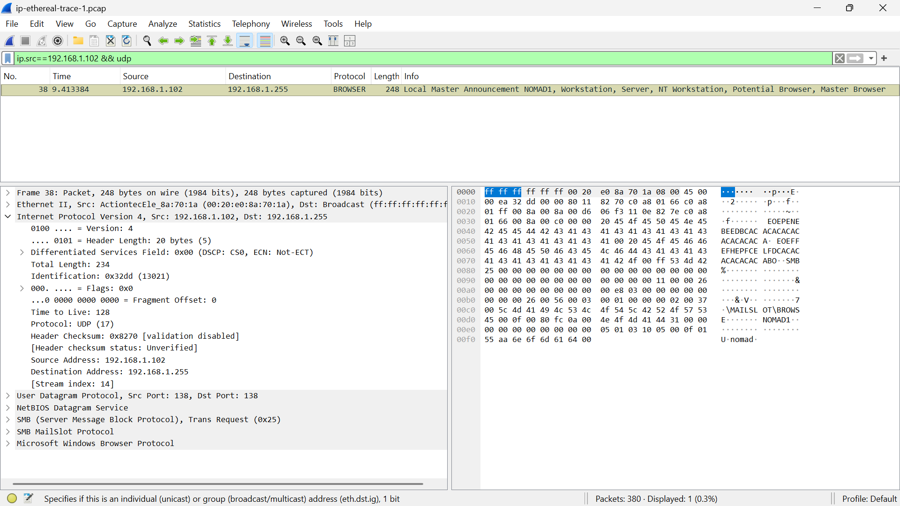

## LAPORAN PRAKTIKUM JARKOM MODUL 10

Nama: Grace Roswita Sallu
NIM: 103072400093

## Tujuan Praktikum Modul 10

1. Mahasiswa dapat menginvestogasi cara kerja protokol IP menggunakan wireshark
2. Mahasiswa mampu menganalisis datagram IPv4 dan IPv6 melalui capture paket jaringan
3. Mahasiswa memahami konsep fragmentasi IP pada datagram berukuran besar

## 10.2

Percobaan Modul 10 dilakukan menggunakan file trace ip-ethereal-trace-1.pcap yang dibuka dan dianalisis menggunakan aplikasi Wireshark. Trace file ini berisi rekaman paket hasil eksekusi program traceroute dari komputer klien menuju server gaia.cs.umass.edu. Berikut adalah hasil dari tiga tahapan percobaan yang dilakukan

Langkah pertama yang dilakukan adalah membuka file trace ip-ethereal-trace-1.pcap di Wireshark. Pada tampilan awal tanpa filter, dapat terlihat berbagai jenis paket yang tertangkap, mencakup ARP, SSDP, ICMP, dan berbagai protokol lainnya. Dari trace ini terlihat jelas aktivitas traceroute yang menghasilkan paket ICMP Echo Request dari host 192.168.1.102 ke 128.59.23.100, serta balasan ICMP Time-to-Live Exceeded dari berbagai router perantara.

## 10.2.1. Bagian 1: IPv4 Dasar

Pada tahap berikutnya, filter tampilan udp || icmp diterapkan pada Wireshark untuk menyaring hanya paket UDP dan ICMP yang ada dalam trace. Hasilnya menampilkan 232 paket dari total 380 paket yang tersedia (61.1% dari keseluruhan). Paket-paket yang tampil terdiri dari ICMP Echo Request yang dikirim oleh host klien dan ICMP Time-to-Live Exceeded yang dikembalikan oleh setiap router perantara sepanjang jalur traceroute

Untuk mempelajari struktur header IPv4 secara lebih mendalam, salah satu paket UDP dipilih dan di-expand pada panel detail Wireshark. Filter yang digunakan adalah ip.src==192.168.1.102 && udp. Pada Screenshot ini terlihat satu paket dengan protokol BROWSER (NetBIOS) yang menggunakan UDP sebagai transport. Detail header Internet Protocol Version 4 berhasil di-expand dan menampilkan seluruh field header IPv4.

# 10.2.3
berdasarkan teori, datagram IPv6 menggunakan alamat 128-bit dan memiliki struktur header yang lebih sederhana dibandingkan IPv4. 

IPv6 merupakan versi terbaru dari Internet Protocol yang dikembangkan untuk mengatasi keterbatasan IPv4, terutama dalam hal ketersediaan alamat. IPv6 menggunakan panjang alamat 128-bit yang ditulis dalam format heksadesimal seperti 2001:db8::1, berbeda dengan IPv4 yang hanya menggunakan 32-bit dengan format desimal seperti 192.168.1.1. Perbedaan ini membuat IPv6 mampu menyediakan jumlah alamat yang jauh lebih besar dibandingkan IPv4.

Dari sisi struktur header, IPv6 memiliki header dengan ukuran tetap sebesar 40 byte, sementara header IPv4 bersifat variabel dengan ukuran minimum 20 byte. Header IPv6 yang tetap ini justru membuat pemrosesan lebih efisien di router karena tidak perlu menghitung panjang header secara dinamis.

Perbedaan lain yang cukup signifikan adalah pada mekanisme fragmentasi. Pada IPv4, fragmentasi dapat dilakukan oleh router di sepanjang jalur pengiriman. Sedangkan pada IPv6, fragmentasi hanya boleh dilakukan oleh host pengirim, bukan oleh router. Hal ini membuat proses routing IPv6 menjadi lebih cepat karena router tidak perlu memproses fragmentasi.

Selain itu, IPv4 memiliki field TTL (Time to Live) untuk membatasi umur paket di jaringan, sedangkan IPv6 menggunakan field bernama Hop Limit yang memiliki fungsi identik namun dengan penamaan yang lebih deskriptif. Perbedaan terakhir yang penting adalah IPv4 menyertakan Header Checksum untuk pengecekan integritas header, sementara IPv6 menghilangkan field ini karena menganggap pengecekan error sudah cukup ditangani oleh lapisan transport (TCP/UDP).