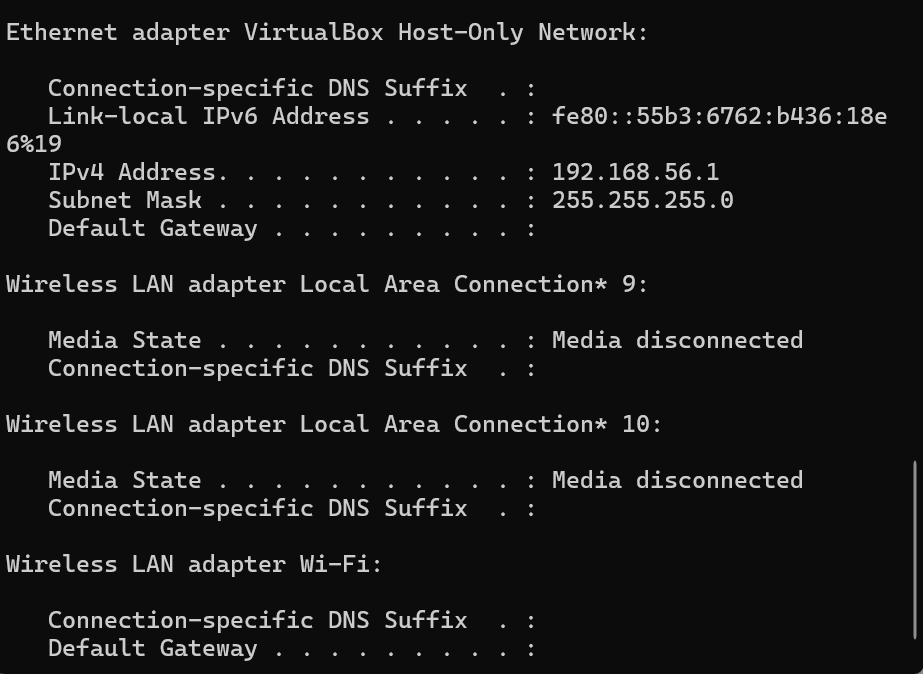
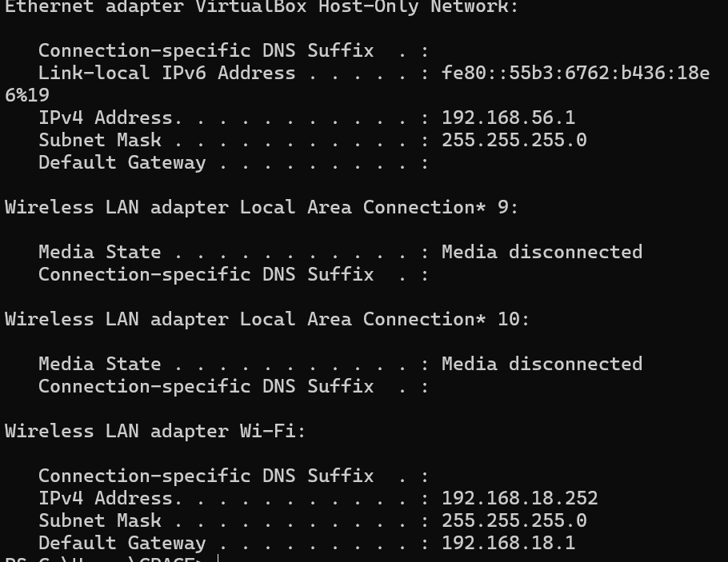

## LAPORAN PRAKTIKUM JARKOM MODUL 11 DHCP

Nama: Grace Roswita Sallu
NIM: 103072400093

# Tujuan Praktikum

1. Mahasiswa dapat menginvestigasi cara kerja protokol DHCP mengguakan wiresharl
2. Mahasiswa dapat memahami proses pertukaran paket DHCP
3. Mahasiswa dapat menganalisis paket DHCP Discover, Offer, Request, dan ACK

# Tahapan Utama DHCP terdiri dari:

1. DHCP Discover Client mencari server DHCP yang tersedia pada jaringan
2. DHCP Offer Server DHCP menawarkan alamat IP kepada client
3. DHCP Request Client meminta alamat IP yang ditawarkan server
4. DHCP ACK Server mengonfirmasi pemberian alamat IP kepada client
   
Selain proses utama tersebut terdapat:
1. DHCP Release = client melepas alamat IP
2. DHCP Renew = client memperpanjang 

# Langkah Percobaan
1. Membuka aplikasi wireshark
2. Memilih interface jaringan yang aktif
3. Menjalankan packet capture
4. Menggunakan filter dhcp
5. Melakukan renew IP address menggunakan cmd
6. Mengamati paket DHCP yang muncul 
7. Menghentikan proses capture
8. Menganalisis paket DHCP Discover, Offer, Request, dan ACK

# Bukti Percobaan

# Filter DHCP

Pada tampilan Wireshark terlihat bahwa setelah filter diterapkan, hanya paket DHCP yang muncul pada packet list. Paket yang berhasil ditampilkan terdiri dari:
- DHCP Discover
- DHCP Offer
- DHCP Request
- DHCP ACK
Filter sangat membantu untuk memisahkan paket DHCP dari paket protokol lain seperti TCP, UDP, DNS, maupun HTTP.
Dengan menggunakan filter DHCP, proses pengamatan pertukaran paket antar client dan server menjadi lebih fokus. Hal ini penting karena dalam jaringan normal terdapat banyak lalu lintas data lain yang dapat mengganggu proses analisis.

# DHCP Discover
DHCP Discover merupakan tahap pertama pada proses DHCP. Pada tahap ini client belum memiliki alamat IP sehingga client melakukan broadcast untuk mencari server DHCP yang tersedia.

Berdasarkan hasil pengamatan pada wireshark ditemukan beberapa informasi yaitu:
- Source IP 0.0.0.0 menunjukkan bahwa client belum memiliki alamat IP.
- Destination IP 255.255.255.255 menunjukkan bahwa paket dikirim secara broadcast ke seluruh jaringan.
- DHCP Discover digunakan client untuk mencari server DHCP aktif.

Pada tahap ini client mencoba meminta konfigurasi jaringan secara otomatis. Karena client belum memiliki IP address maka komunikasi dilakukan menggunakan broadcast.
Tahap DHCP Discover menjadi tahap paling awal dalam proses DHCP DORA.

# DHCP OFFER
Setelah server menerima DHCP Discover dari client, server akan merespons dengan mengirimkan DHCP Offer.

- Offered IP Address merupakan alamat IP yang akan diberikan kepada client.
- Lease Time menunjukkan batas waktu penggunaan alamat IP.
- DHCP Server Identifier menunjukkan identitas server yang memberikan penawaran.

DHCP Offer menunjukkan bahwa server DHCP telah menemukan permintaan dari client dan siap memberikan konfigurasi jaringan.
Pada tahap ini client masih belum resmi menggunakan IP address karena masih perlu mengirim DHCP Request.

# DHCP Request
Setelah client menerima DHCP Offer, client mengirim DHCP Request sebagai tanda bahwa client menerima penawaran alamat IP dari server.

- Requested IP Address menunjukkan alamat IP yang dipilih client.
- DHCP Server Identifier menunjukkan server yang dipilih apabila terdapat lebih dari satu server DHCP.
Analisis

DHCP Request berfungsi sebagai konfirmasi dari client terhadap alamat IP yang ditawarkan server.
Tahap ini penting karena server perlu mengetahui apakah client benar-benar menerima konfigurasi yang ditawarkan.

# DHCP ACK
DHCP ACK merupakan tahap akhir dari proses DHCP DORA. Pada tahap ini server mengonfirmasi bahwa alamat IP berhasil diberikan kepada client.

- Assigned IP Address menunjukkan alamat IP resmi yang digunakan client.
- Default Gateway digunakan untuk komunikasi keluar jaringan lokal.
- DNS Server digunakan untuk menerjemahkan domain menjadi alamat IP.

Setelah DHCP ACK diterima, client dapat menggunakan alamat IP tersebut untuk terhubung ke jaringan dan internet.
Tahap ACK menjadi penutup proses DHCP DORA.

# Analisis Proses DHCP DORA

Penjelasan Alur
1. Discover = Client mencari server DHCP.
2. Offer = Server menawarkan alamat IP.
3. Request = Client meminta alamat IP yang ditawarkan.
4. ACK = Server menyetujui dan memberikan alamat IP.
Proses DHCP DORA memungkinkan pemberian alamat IP dilakukan secara otomatis tanpa konfigurasi manual.
Hal ini membuat manajemen jaringan menjadi lebih efisien terutama pada jaringan dengan banyak perangkat.

# DHCP Release
DHCP Release digunakan ketika client ingin melepaskan alamat IP yang sedang digunakan.

Pada paket DHCP Release terlihat bahwa client mengirim pesan kepada server DHCP untuk mengembalikan alamat IP.
Dengan adanya DHCP Release, alamat IP dapat digunakan kembali oleh perangkat lain sehingga penggunaan alamat IP menjadi lebih efisien.

# DHCP Renew
DHCP Renew digunakan untuk memperpanjang masa penggunaan alamat IP sebelum lease time habis

Pada paket DHCP Renew terlihat client meminta perpanjangan lease time kepada server DHCP.
DHCP Renew membantu client mempertahankan alamat IP yang sama sehingga koneksi jaringan tetap stabil tanpa perlu mendapatkan IP baru

# Kesimpulan
Berdasarkan praktikum yang telah dilakukan, dapat disimpulkan bahwa:

1. DHCP bekerja untuk memberikan alamat IP secara otomatis kepada client.
2. Proses DHCP terdiri dari Discover, Offer, Request, dan ACK.
3. Wireshark dapat digunakan untuk menganalisis komunikasi DHCP secara detail.
4. DHCP mempermudah pengelolaan jaringan komputer.