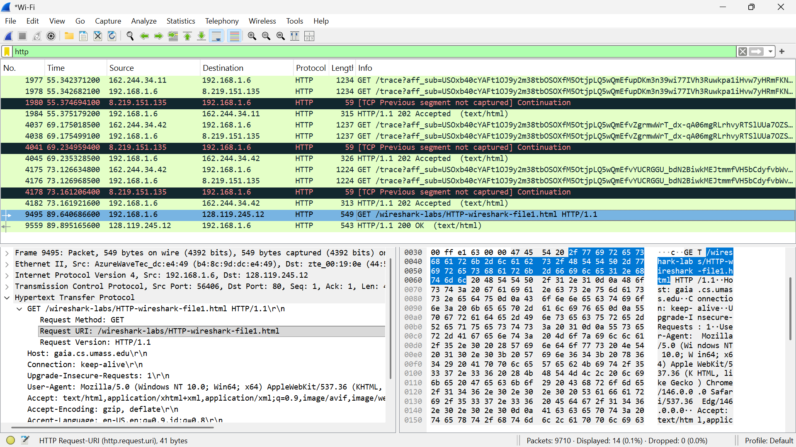
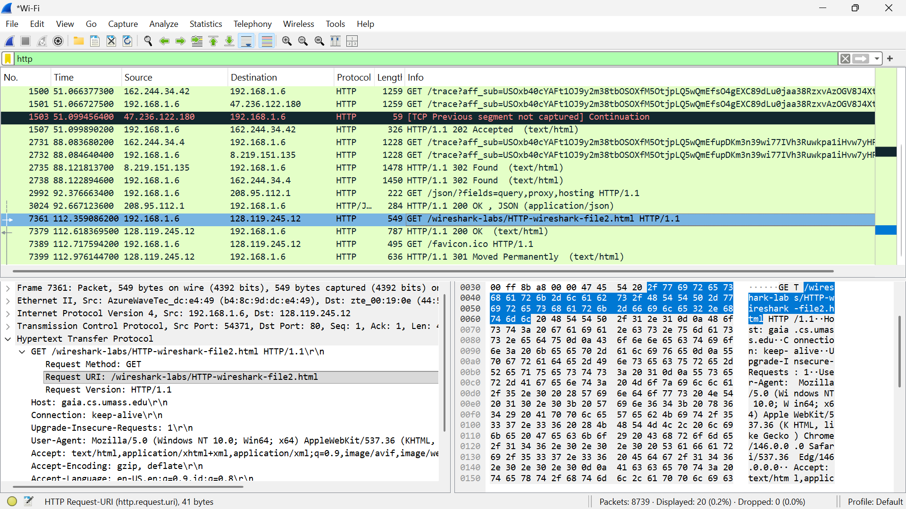
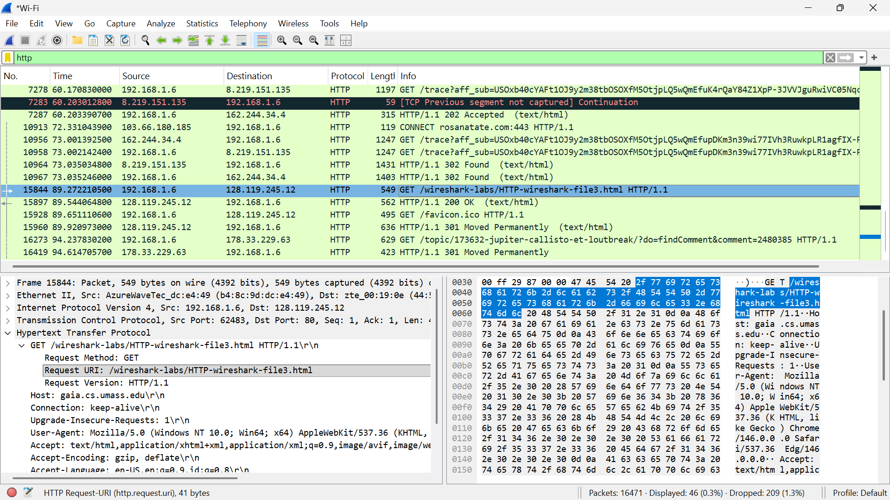
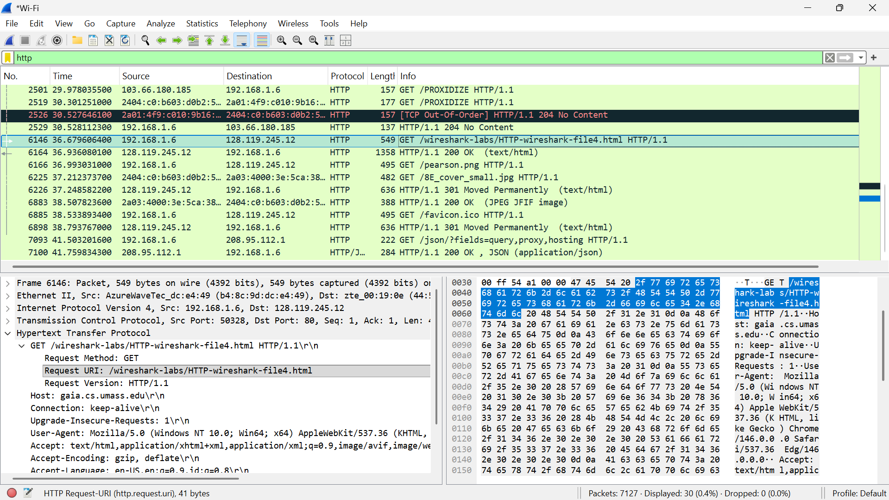
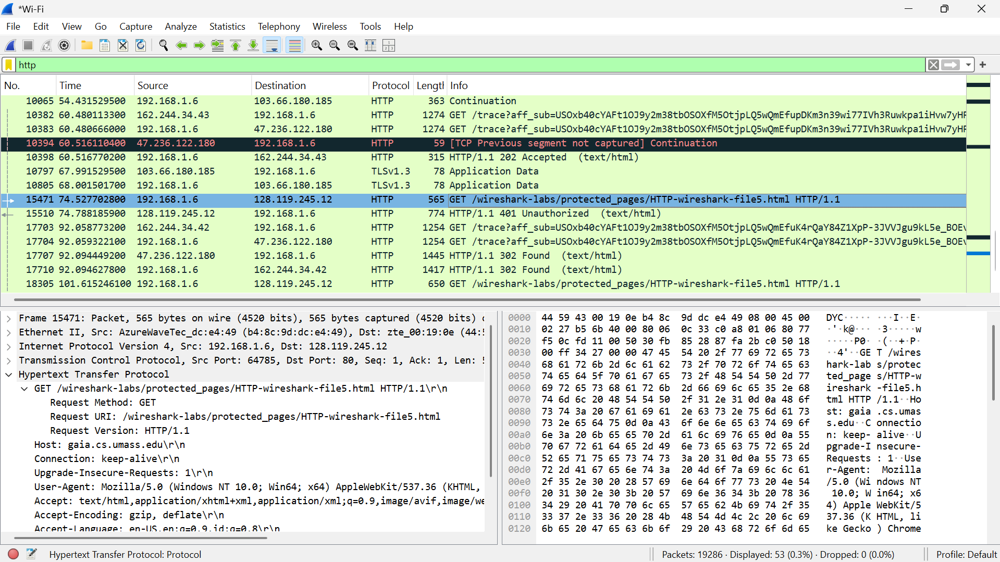
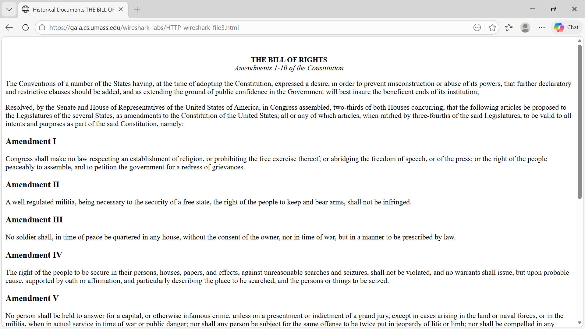
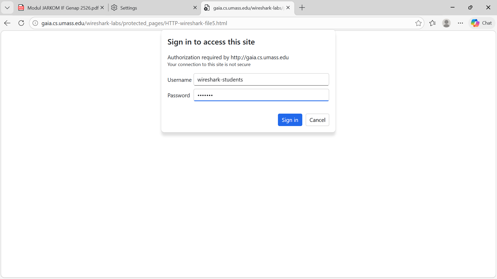
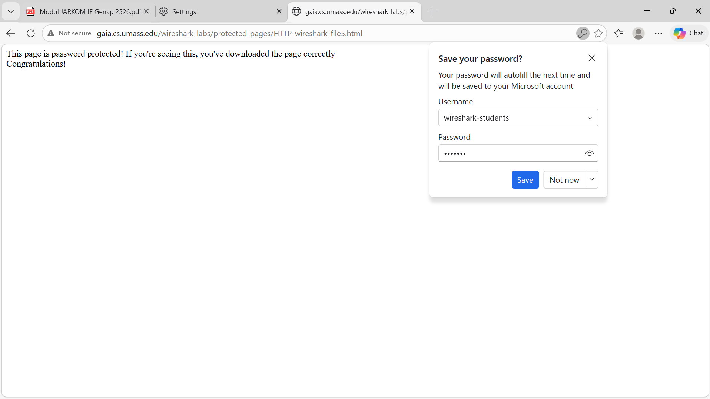

# laporan Praktikum Jarkom Modul 3.2 - 3.5 HTTP

## Tujuan Praktikum

Tujuan dari praktikum ini adalah untuk memahami cara kerja protokol HTTP dengan menggunakan tools Wireshark. Selain itu, praktikum ini juga bertujuan untuk mengamati proses komunikasi antara client dan server melalui HTTP, termasuk proses request dan response, mekanisme caching, pengambilan dokumen berukuran besar, halaman dengan embedded objects, serta autentikasi pada HTTP

## Langkah Kerja dan Hasil Pengamatan

- Basic HTTP GET/ Responses Interaction (3.2)

1. Membuka aplikasi wireshark
2. Mengatur display filter dengan mengetik http
3. Memulai capture paket
4. Membuka browser dan mengakses http://gaia.cs.umass.edu/wireshark-labs/HTTP-wireshark-file1.html
5. Menghentikan capture setelah halaman terbuka

## Hasil Percobaan

Ditemukan paket HTTP GET dari client ke server beserta responseHTTP/1.1 200 OK. Di mana pada percobaan ini terlihat bahwa komunikasi HTTP dimulai dari client yang mengirimkan request GET ke server. Server kemudian merespon dengan status 200 OK yang menandakan bahwa permintaan berhasil diproses

## Langkah Kerja HTTP Conditional GET (3.2.2)

1. Menghapus cache browser
2. Memulai capture Wireshark
3. mengakses kembali URL yaitu http://gaia.cs.umass.edu/wireshark-labs/HTTP-wireshark-file2.html
4. Menghentikan capture

## Hasil Percobaan

## Langkah Kerja Retrieving Long Documents (3.3)

1. Memulai capture Wirehsark
2. Mengakses file HTML berukan besar melalui http://gaia.cs.umass.edu/wireshark-labs/HTTP-wireshark-file3.html
3. Menghentikan capture

## Hasil Percobaan

Hasil pengamatan terdapat data yang dikirim dalam beberapa paket dan terlihat banyak segmen TCP sehingga dokumen besar tidak dikirim sekaligus, melainkan dipecah menjadi beberapa segment TCP agar pengiriman lebih efisien dan dapat dikontrol

## Langkah Kerja HTML dengan Embedded Objects (3.4)

1. Memulai capture wireshark
2. Mengakses halaman web yang memiliki gambar atau objek lain http://gaia.cs.umass.edu/wireshark-labs/HTTP-wireshark-file4.html
3. Menghentikan capture

## Hasil Percobaan

Terdapat banyak HTTP GET sehingga request tidak hanya untuk HTML, tetapi juga untuk gambar, CSS dan JavaScript. Jadi satu halaman web dapat terdiri dari banyak objek, sehingga browser harus melakukan beberapa request HTTP untuk mengambil semua komponen tersebut

## Langkah Kerja HTTP Authentication (3.5)

1. Memulai capture wireshark
2. Mengakses halaman yang membutuhkan autentikasi http://gaia.cs.umass.edu/wireshark-labs/protected_pages/HTTP-wireshark-file5.html
3. Menghentikan capture

## Hasil Percobaan

HTTP authenthication digunakan untuk membatasi akses ke suatu resource. Informasi autentikasi dikirim melalui header HTTP

## Lampiran

Hasil Percobaan:

