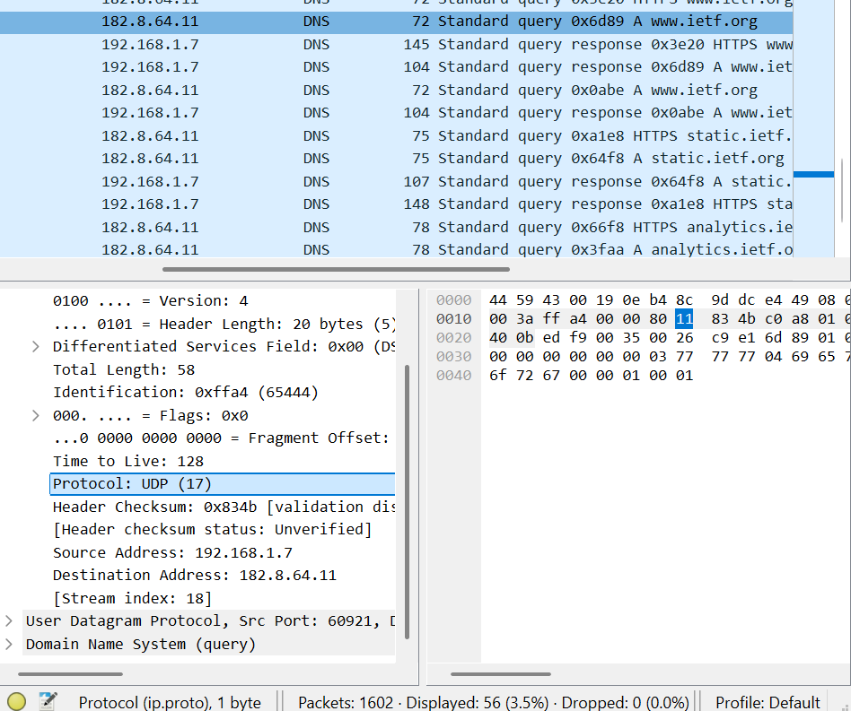
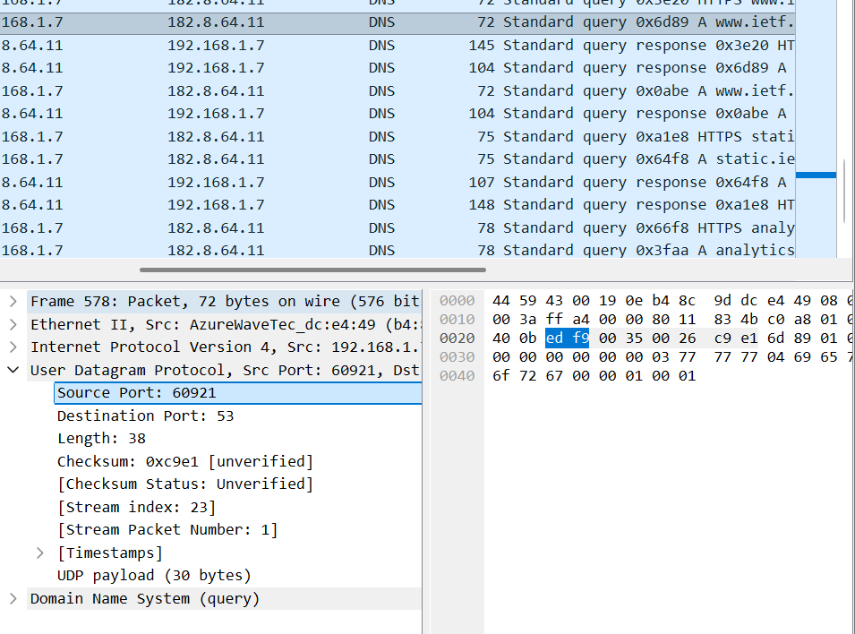

# Laporan Praktikum Modul 4 (4.1-4.5)

## Tujuan Praktikum

Mahasiswa dapat menginvestigasi cara kerja DNS menggunakan wireshark dengan memahami cara kerja DNS, mengamati proses query dan response DNS, serta menganalisis paket DNS menggunakan wireshark

## Langkah Kerja

## 4.2 Menggunakan nslookup

1. Buka cmd
2. Ketik perintah 'nslookup www.google.com'
3. Tekan enter
4. Amati hasil yang muncul dari alamat IP domain dan DNS server yang digunakan
   
   melalui percobaan ini menunjukkan perintah "tolong kirimkan alamat IP untuk host www.google.com". Sehingga jawaban dari perintah ini menyediakan dua informasi: (1)nama (dns.google) dan alamat IP server DNS (8.8.8.8) yang memberikan jawaban dari perintah yang dimasukkan, (2) jawaban dari perintah tersebut, berupa nama host (www.google.com) dan alamat IP www.google.com (seperti yang ada di gambar IPv6 dan IPv4)

5. Lanjut di cmd tadi ketik 'nslookup -type-NS www.google.com'
6. Tekan enter
7. Amati hasil yang muncul dari alamat IP domain dan DNS server yang digunakan
   
   Pada tahap ini, digunakan opsi -type=NS dengan domain google.com. Hal ini menyebabkan perintah nslookup mengirimkan permintaan untuk record tipe NS (Name Server) ke server DNS default, yaitu dns.google (8.8.8.8). Permintaan ini berarti, “tolong tampilkan nama host dari DNS otoritatif untuk domain google.com.”

Dari hasil yang ditampilkan, terlihat bahwa server DNS yang memberikan jawaban adalah dns.google dengan alamat IP 8.8.8.8. Hasil yang diperoleh menunjukkan 4 nama server DNS untuk domain google.com. Keempat server tersebut merupakan server DNS otoritatif untuk domain google.com.

Namun, hasil nslookup menunjukkan status “Non-authoritative answer”, yang berarti jawaban tersebut tidak berasal langsung dari server DNS otoritatif google.com, melainkan dari cache server DNS (dns.google) yang digunakan.

Selain itu, pada hasil ini hanya ditampilkan nama server (NS record) tanpa alamat IP dari masing-masing server DNS. Hal ini karena permintaan yang dilakukan hanya meminta record tipe NS, sehingga informasi yang diberikan terbatas pada nama server DNS saja.

1. Lanjut di cmd tadi ketik 'nslookup www.google.com 8.8.8.8'
2. Tekan enter
3. Amati hasil yang muncul dari alamat IP domain dan DNS server yang digunakan
   
   Gambar tersebut merupakan hasil perintah nslookup yang menampilkan alamat IP dari suatu domain. Terlihat bahwa domain tersebut memiliki beberapa alamat IP, baik IPv4 (misalnya 142.251.xxx.xxx) maupun IPv6 (2001:4860:xxxx::).

Banyaknya alamat IP ini menunjukkan bahwa domain menggunakan load balancing, yaitu membagi trafik ke beberapa server agar akses lebih cepat dan stabil. Hal ini juga menunjukkan bahwa satu domain dapat diterjemahkan menjadi lebih dari satu alamat IP oleh DNS.

## 4.3 Ipconfig

1. Masih di CMD namun sekarang klik cmd 'ipconfig /all'
2. Tekan enter
3. Catat informasi IPv4 Address komputer, DNS Server, dan default gateway
   
   
   IPv4 Address komputer: 192.168.1.9
   DNS Server:
   8.8.8.8
   8.8.4.4
   Default Gateway: 192.168.1.1
   Perintah ipconfig /all digunakan untuk menampilkan seluruh konfigurasi jaringan pada komputer.

- IPv4 Address
  Alamat 192.168.1.9 adalah identitas unik komputer kamu di dalam jaringan lokal (LAN). Angka ini menunjukkan bahwa kamu berada dalam jaringan 192.168.1.x
  Biasanya digunakan di rumah/kampus (private network)
- Default Gateway
  Alamat 192.168.1.1 adalah pintu keluar jaringan kamu ke internet.
  Biasanya ini adalah router atau modem Wi-Fi
  Semua akses ke luar jaringan lokal akan melewati gateway ini
- DNS Server
  DNS yang digunakan:8.8.8.8 dan 8.8.4.4
  Ini adalah DNS milik Google. Fungsinya:Mengubah alamat website (contoh: google.com) menjadi alamat IP
  Memungkinkan kamu browsing internet dengan nama domain

1. Masih di CMD namun sekarang klik cmd 'ipconfig /displaydns'
2. Tekan enter
3. Catat informasi dari hasil percobaan
   
   

Kemunculan google.com membuktikan bahwa DNS cache masih menyimpan hasil pencarian sebelumnya. Ini normal dan justru membantu mempercepat koneksi. cache ini akan hilang otomatis atau bisa dihapus manual dengan ipconfig /flushdns

1. Masih di CMD namun sekarang klik cmd 'ipconfig /flushdns'
2. Tekan enter
3. Catat informasi dari hasil percobaan
   
   Mengosongkan catatan DNS berarti menghapus semua record dan memuat ulang record dari file host. Sehingga terlihat tidak ada ladi dns google.com

## 4.4 Tracing DNS dengan wireshark

1. Buka Wireshark
2. Pilih interface (Wi-Fi)
3. Klik Start Capture
4. filter "ip.addr == 192.168.1.7 && dns"
5. Jalankan:nslookup www.ietf.org
6. Stop capture setelah selesai
7. pilih info yang memiliki ietf
8. Lalu analisis IP tujuan query, isi response, dan DNS query DNS response

## Jawaban

1. terdapat 3 request dan 3 response dan dikirimkan melalui UDP
   
   
2. port tujuan pada pesan permintaan DNS adalah 53 dan sumber port nya adalah 60921
   
3. 
   
   Iya kedua alamat IP sama
4.  tidak ada jawaban
5. 
6. 
7. Host tidak selalu mengirim DNS request baru setiap kali mengambil gambar, karena DNS hasil sebelumnya bisa disimpan di cache dan DNS baru hanya diperlukan jika mengakses domain yang berbeda

## Jawaban Soal mit.edu 1

1. 
2.  iyaa sama denganserver DNS lokal saya
3.  pesan tidak mengandung jawaban
4. Karena tidak ada jawaban jadi tidak ada isinya

## Jawaban Soal mit.edu 2

1. .png>) iya IP merupakan default alamat IP
2.  tidak mengandung answer
3. 

## Jawaban Soal mit.edu 3

1. 
2. 
3. tidak ada jawaban
