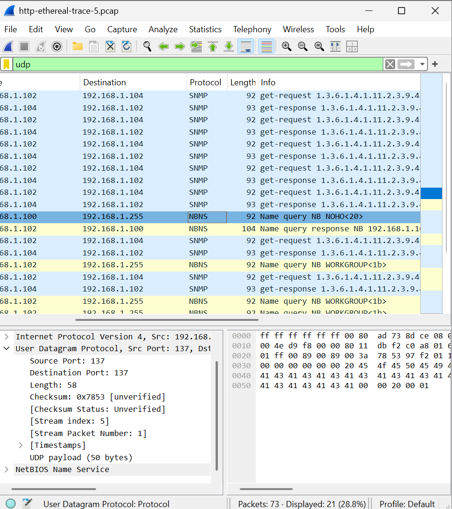
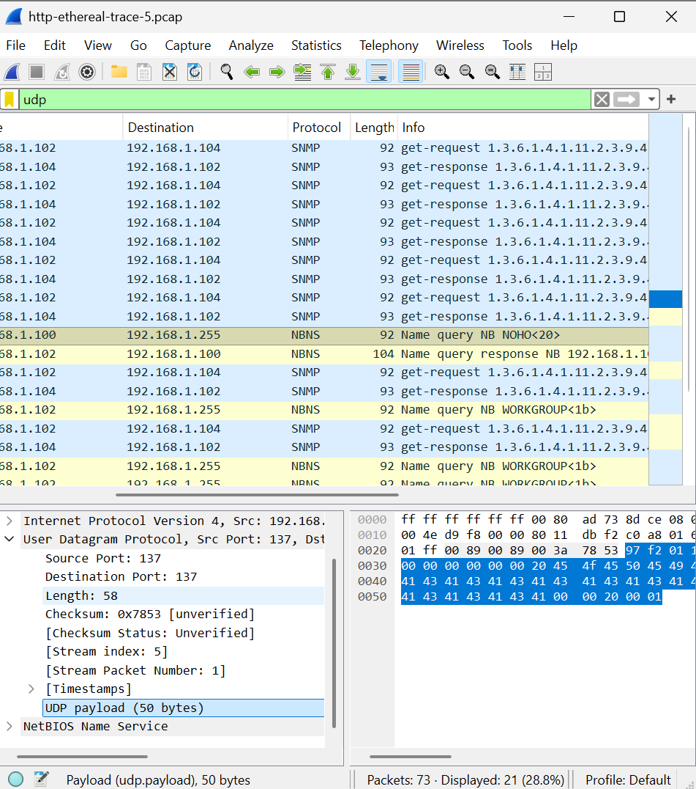
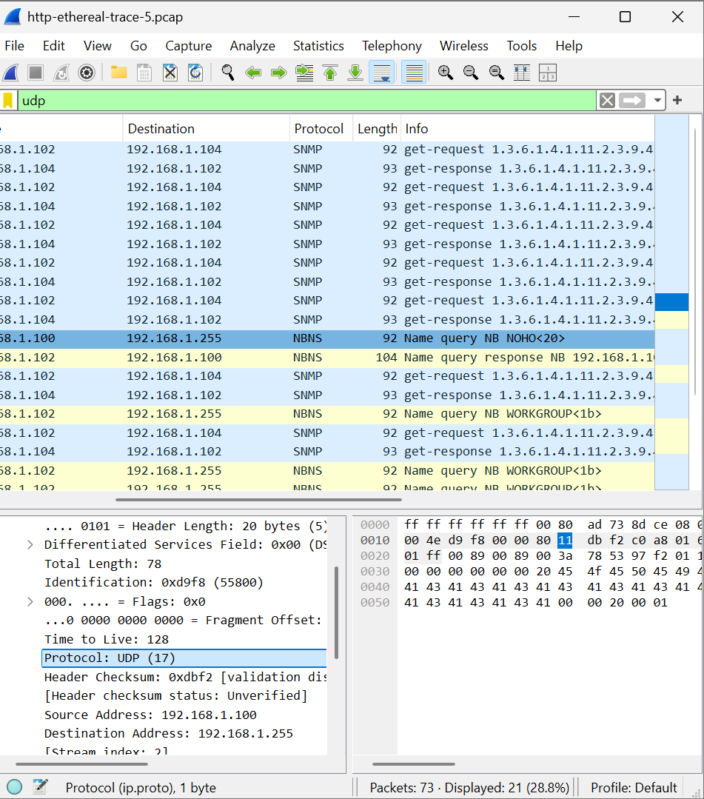
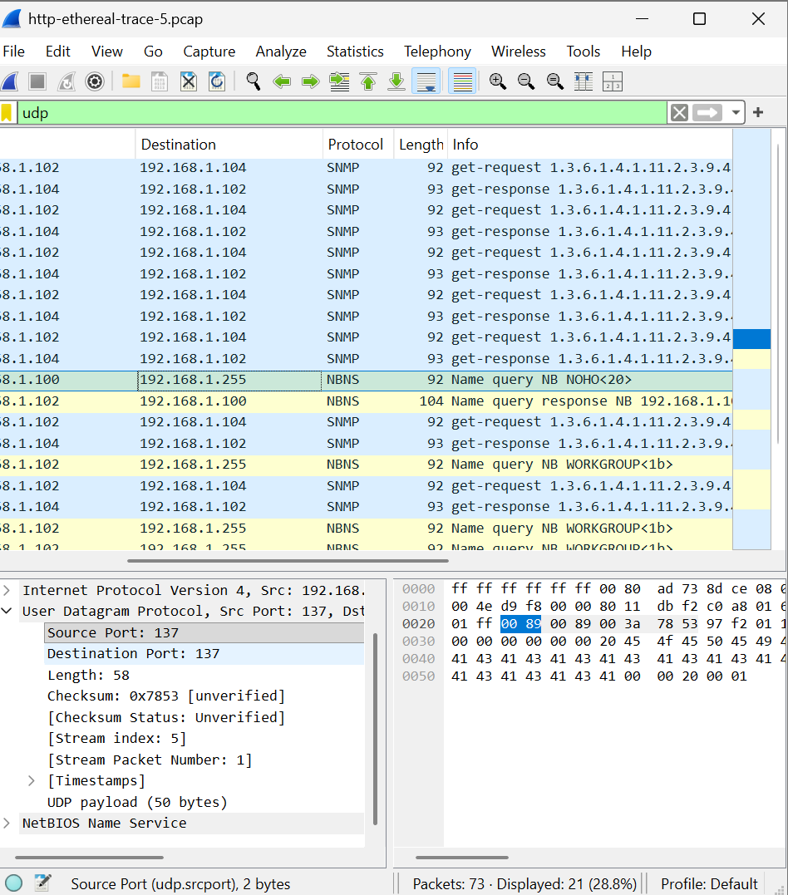
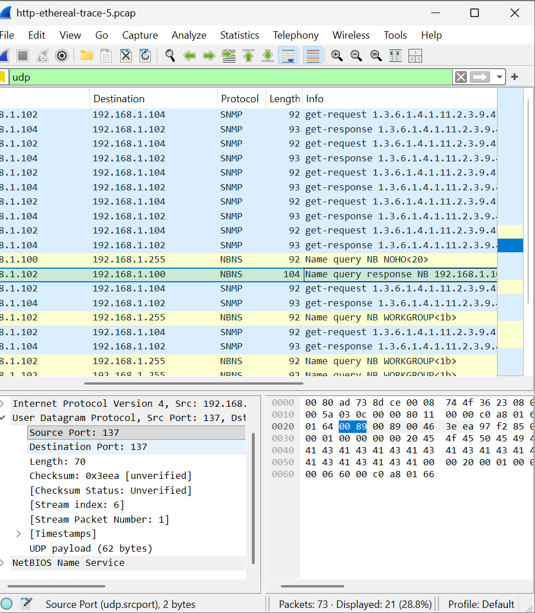

# Laporan Modul 5 Analisis Protokol UDP Menggunakan Wireshark

## Tujuan Praktikum

Tujuan dari praktikum ini adalah untuk memahami cara kerja protokol UDP, menganalisis struktur header UDP, serta mengamati komunikasi UDP menggunakan Wireshark.

## Langkah-Langkah

1. Membuka palikasi wireshark
2. Membuka file trace http-ethereal-trace-5 melalui menu file yang sudah di donwload
3. Menjalankan filter paket dengan mengetik udp untuk menampilkan paket UDP
4. Memilih salah satu paket UDP (NBNS atau SNMP) dari daftar hasil caprture
5. Mengamati bagian user datagram protocol pada detail paket untuk melihat source port, destination port, lenght, dan checksum
6. Mencatat nilai length dan ukuran payload
7. Mencari pasangan paket request dan response (SNMP) dengan memperhatikan alamat IP dan waktu pengiriman
8. Membandingkan nomor port pada paket request dan response
9. Medokumentasikan hasil pengamatan dalam bentuk screenshot dan analisis

## Jawaban Soal

1. 
   field yang saya temukan adalah source port, destination port, length, dan checksum
2. Header UDP terdiri dari 4 field yaitu Source Port, Destination Port, Length, dan Checksum. Masing-masing field memiliki ukuran 2 byte sehingga total panjang header UDP adalah 8 byte.Hal ini dapat diverifikasi pada Wireshark dengan melihat nilai Length yang merupakan jumlah header dan payload.
3. 
   Field Length pada header UDP menyatakan total panjang datagram UDP yang terdiri dari header dan payload.
4. Berdasarkan hasil pengamatan pada Wireshark, diperoleh nilai Length sebesar 58 byte, sedangkan ukuran payload adalah 50 byte. Karena header UDP memiliki panjang 8 byte, maka totalnya adalah 50 + 8 = 58 byte. Hal ini membuktikan bahwa field Length menunjukkan ukuran keseluruhan UDP (header + data).
5. Panjang maksimum payload UDP adalah 65527 byte. Hal ini karena field Length pada UDP memiliki ukuran 16 bit sehingga maksimum panjang total UDP adalah 65535 byte. Karena header UDP memiliki panjang 8 byte, maka payload maksimum yang dapat dikirim adalah 65535 - 8 = 65527 byte.
6. 
   Berdasarkan hasil pengamatan pada Wireshark di bagian Internet Protocol, field Protocol menunjukkan nilai UDP (17). Oleh karena itu, nomor protokol UDP adalah 17 dalam desimal dan 0x11 dalam notasi heksadesimal
7. 
   
   Berdasarkan analisis pasangan paket SNMP get-request dan get-response, terlihat bahwa nomor port pada kedua paket saling berkebalikan. Pada paket request, source port menjadi destination port pada paket response, dan destination port pada paket request menjadi source port pada paket response. Hal ini menunjukkan bahwa balasan dikirim kembali ke port asal pengirim.
