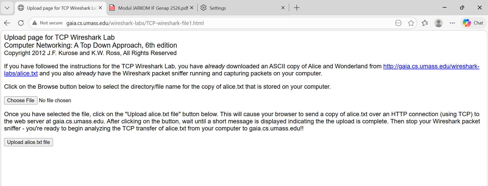
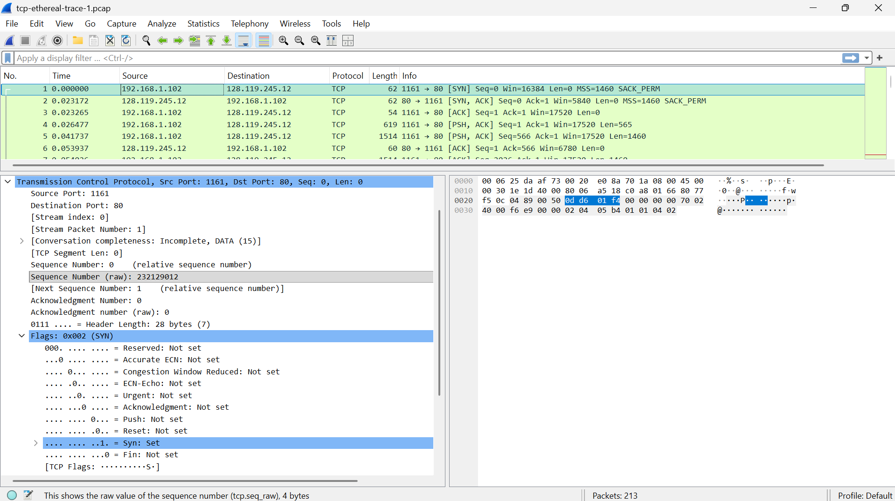
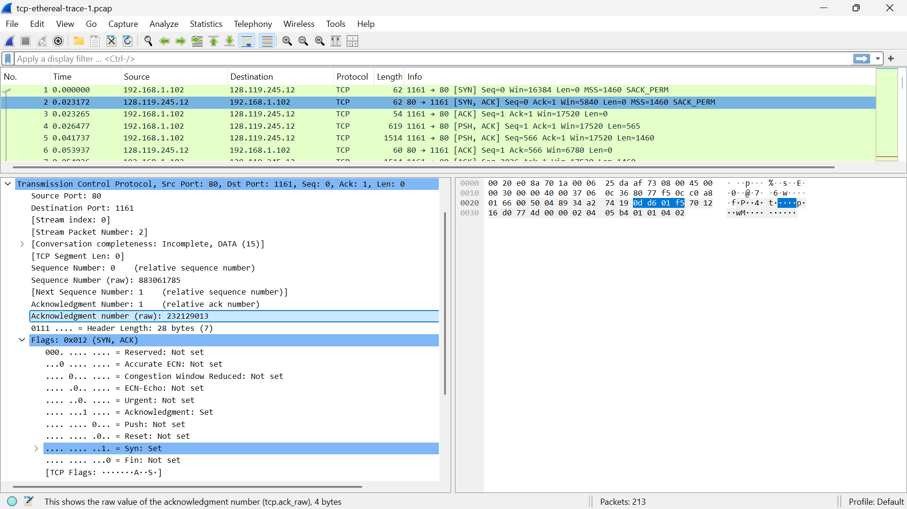
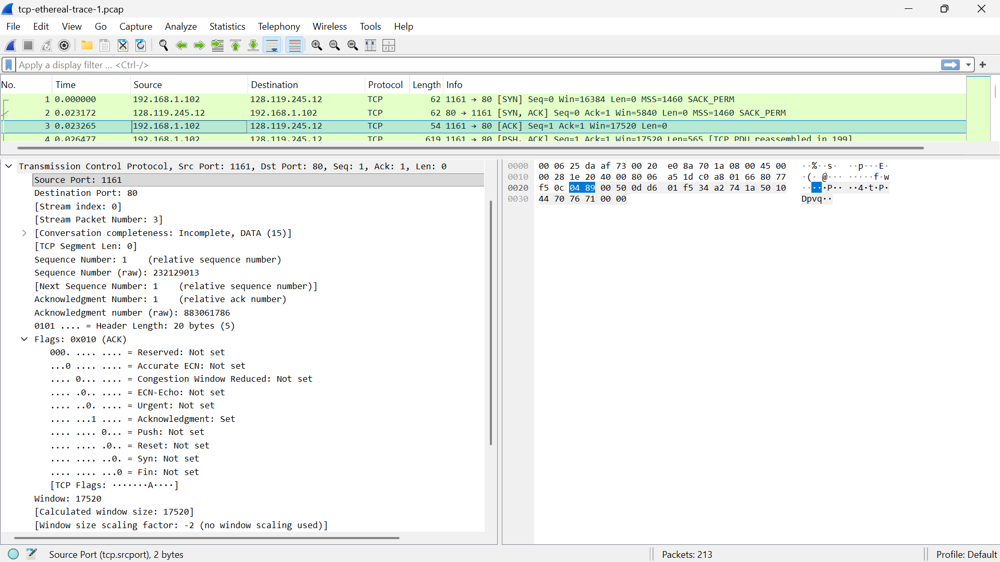
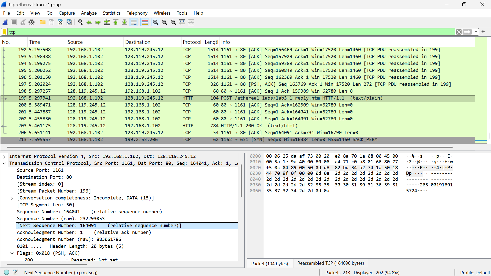
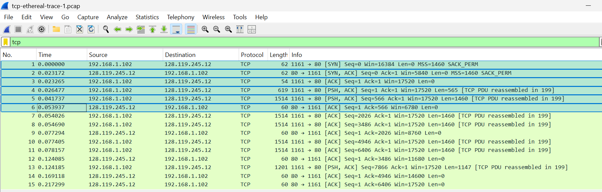

## Laporan Modul 6 TCP

## Tujuan Praktikum

Tujuan dari praktikum ini adalah untuk memahami cara kerja Transmission Control Protocol (TCP), dengan menganalisi proses 3-way hanshake (SYN, SYN-ACK, ACK), lalu mengamati sequence number dan acknowledgement number, menghitung roud trip time (RTT), mengidentifikasi panjang segmen TCP, menganalisis buffer, dan mendeteksi adanya retransmission

## Langkah-Langkah Percobaan Browser

1. Membua aplikasi wireshark
2. Memilih jaringan WiFi
3. Memulai proses capture paket
4. Membuka browser dan mengakses link http://gaia.cs.umass.edu/wireshark-labs/HTTP-wireshark-file3.html 
5. Menghentikan proses capture di wireshark
6. Memfilter paket dengan filter tcp 
7. Amati apakah wireshark sudah menangkap server (OK & Hello client)
   .png>)
   

## Langkah - Langkah Percobaan File Zip

1. Buka wireshark
2. Klik File -> Open
3. Pilih file tcp-ethereal-trace-1
4. Filter bar ketik tcp lalu tekan enter 
5. Identifikasi koneksi TCP 

## Analisis dan Jawaban dari Pertanyaan

## 6.3

1. 
   Berdasarkan hasil analisis pada file tcp-ethereal-trace-1 menggunakan Wireshark, dapat diidentifikasi alamat IP yang terlibat dalam komunikasi TCP. Client merupakan host yang pertama kali menginisiasi koneksi dengan mengirimkan paket SYN, sedangkan server adalah host yang merespons dengan paket SYN-ACK. Dari hasil pengamatan, terlihat bahwa alamat IP 192.168.1.102 bertindak sebagai client karena mengirimkan paket SYN pertama. Kemudian untuk nomor port TCP Client adalah 1161
2. Berdasarkan analisis pada detail paket yang terpilih di Wireshark, informasi mengenai server gaia.cs.umass.edu dapat diidentifikasi sebagai berikut:
   Pada bagian Internet Protocol Version 4 (IPv4), baris Destination menunjukkan alamat 128.119.245.12. Ini adalah alamat IP publik dari server gaia.cs.umass.edu yang menjadi tujuan pengiriman data.
   Pada bagian Transmission Control Protocol (TCP), baris Destination Port menunjukkan nomor 80. Hal ini menunjukkan bahwa server menerima permintaan koneksi dan mengirimkan respon melalui port 80, yang merupakan port standar untuk layanan HTTP (Web).
3. 

## 6.4

1. [Bukti Analisis SYN](../assets/image/modul6/6.3.1.png)
   Nomor urut pertama Segmen tersebut teridentifikasi sebagai segmen SYN karena di dalam header TCP, tepatnya pada bagian Flags, bit Syn bernilai 1 (Set) dengan nilai hexadesimal 0x002. Keberadaan flag ini menandakan bahwa paket tersebut adalah paket pertama dalam proses 3-way handshake yang bertujuan untuk sinkronisasi nomor urut awal.
2. 
   Nomor urut segmen SYN-ACK yang dikirim oleh server tcp-ethereal-trace-1 adalah 2. Adapun nilai Acknowledgment Number-nya adalah 0.
   Segmen tersebut teridentifikasi sebagai SYN-ACK karena pada header TCP bagian Flags, bit Syn dan bit Acknowledgment keduanya bernilai 1 (Set) dengan nilai hexadesimal 0x012. Ini menunjukkan respon persetujuan server terhadap permintaan koneksi dari klien.
3. 
   Penentuan segmen ini dilakukan dengan memeriksa isi paket pada jendela Packet Bytes di Wireshark. Pada paket nomor 199, ditemukan data string berupa "POST" yang menandakan bahwa segmen tersebut membawa permintaan metode POST dari klien ke server. Berdasarkan detail header TCP pada paket tersebut, nilai Sequence Number (raw) yang tercatat adalah 164041.
4.  Semua jawaban lengkap di detail paket ini
   
5. 
   Pada gambar tersebut terlihat perbedaan length dari 6 paket pertama yaitu 62, 62, 54, 619, 1514, dan 60
6. 
   Tertera win itu buffer, setelah dilihat dan ditelusuri lebih lanjut tidak ada karena tidak ada yang 0 atau terhambat
7. 
   dia tidak melakukan transmisi ulang karena tidak ada tcp
8. 8 dan 9 tidak dikerjakan

## 6.5

1. 
   Slow Start: Terjadi pada interval 0 - 1 detik, di mana terlihat kenaikan nomor urut secara eksponensial seiring bertambahnya jendela kongesti secara cepat.
   Congestion Avoidance: Dimulai setelah detik ke-1, ditandai dengan perubahan kemiringan grafik menjadi linier (garis lurus stabil) hingga pengiriman data selesai.
   Data hasil pengukuran menunjukkan perilaku yang sangat stabil dibandingkan teori ideal. Tidak ditemukan adanya clipping atau penurunan grafik yang menandakan packet loss. Hal ini menunjukkan bahwa algoritma congestion avoidance berhasil menjaga aliran data tetap berada di bawah kapasitas maksimal jalur komunikasi tanpa memicu kemacetan.
2. tidak dikerjakan
