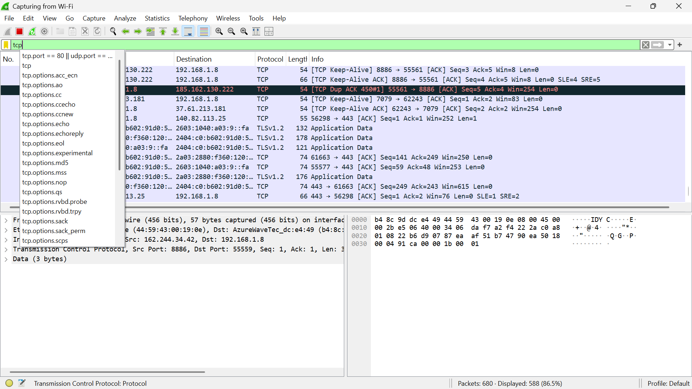
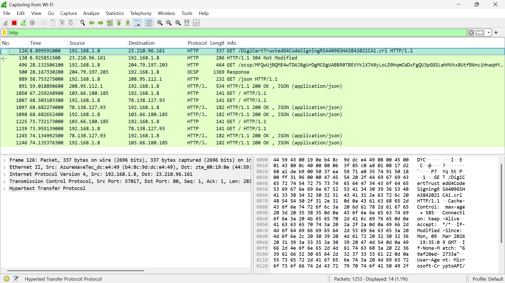
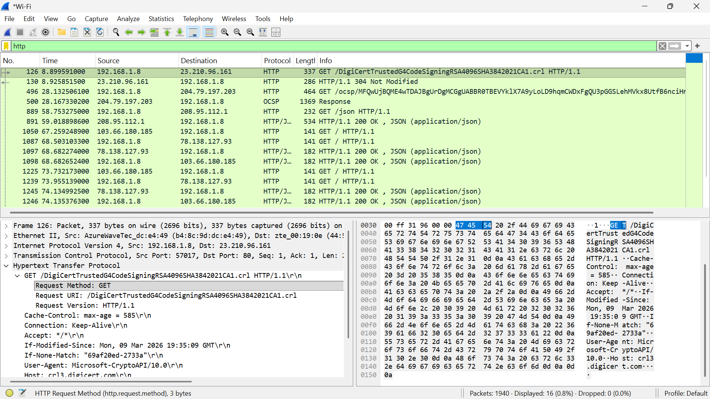
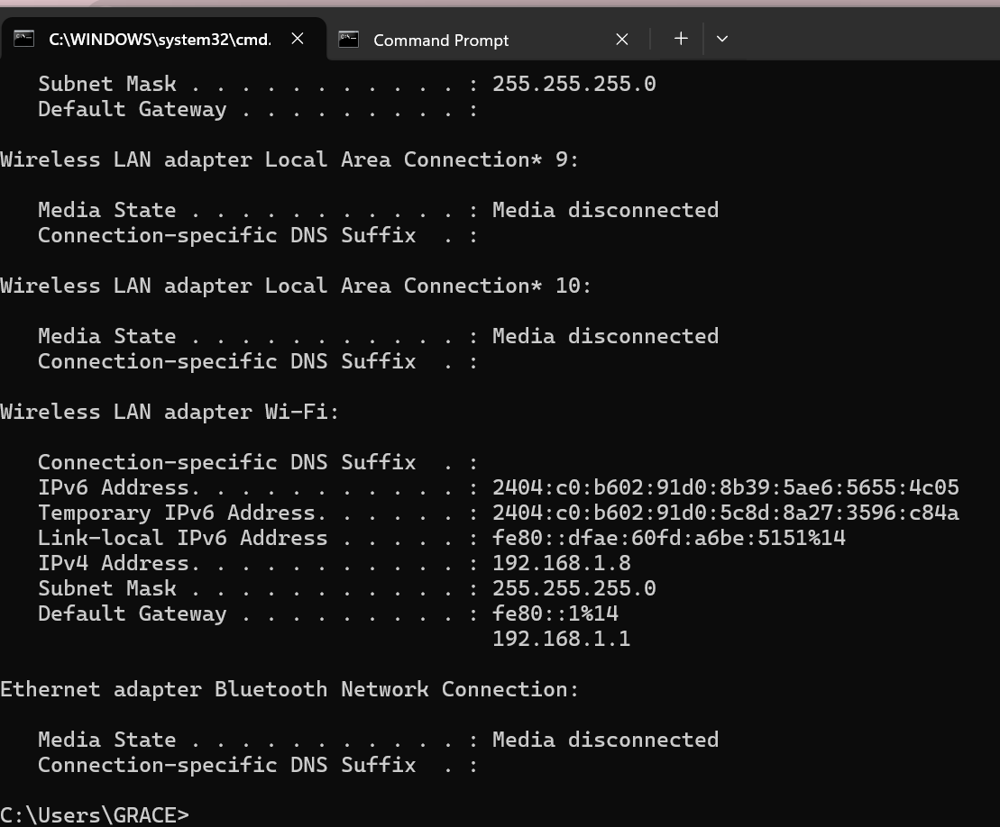

# laporan Praktikum Jarkom Modul 3 HTTP

## Tujuan Praktikum

1. Memahami cara kerja protokol HTTP, khususnya proses HTTP GET dan HTTP Response antara client (browser) dan server.
2. Menggunakan Wireshark sebagai packet sniffer untuk menangkap paket jaringan yang terjadi saat mengakses sebuah halaman web.
3. Mengidentifikasi paket HTTP yang muncul ketika browser meminta sebuah file HTML dari server.
4. Menganalisis isi paket HTTP, seperti request method, request URI, dan response dari server.
5. Memahami proses komunikasi client–server pada jaringan melalui pengamatan langsung terhadap paket yang dikirim dan diterima.

## Langkah Percobaan

1. Jalan browser web anda
2. Menjalankan wireshark yang sudah di download sebelumnya
3. Pilih interface jaringan yang digunakan (Wi-Fi)
4. Klik Start untuk mulai menangkap paket jaringan.
5. Pada bagian display filter di bagian atas wireshark ketik http
6. Tunggu sedikit lebih dari satu menit, dan kemudian mulai pengambilan paket Wireshark.
7. Masukkan berikut ini ke browser Anda http://gaia.cs.umass.edu/wireshark-labs/HTTP-wireshark-file1.html, Browser Anda akan menampilkan file HTML satu baris yang sangat sederhana.
8. Hentikan pengambilan paket Wireshark

## Lampiran

Hasil Percobaan:

